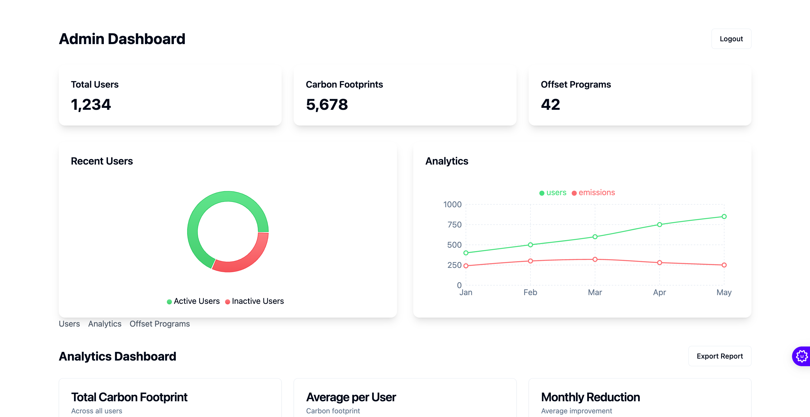
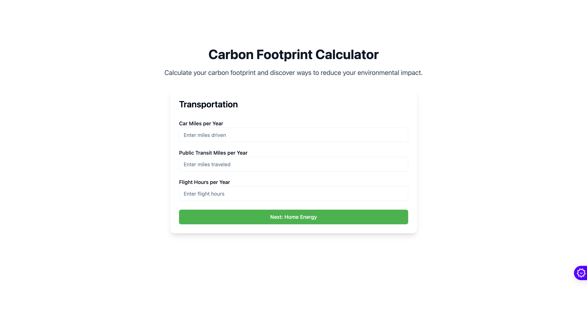
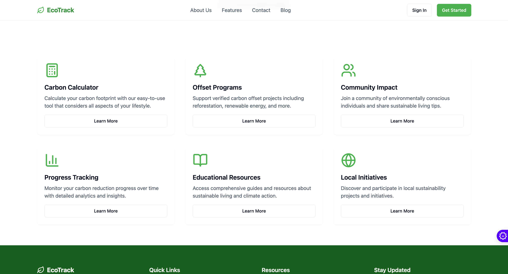
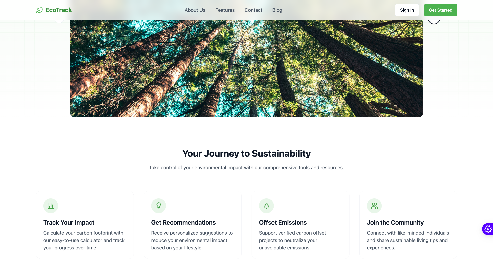
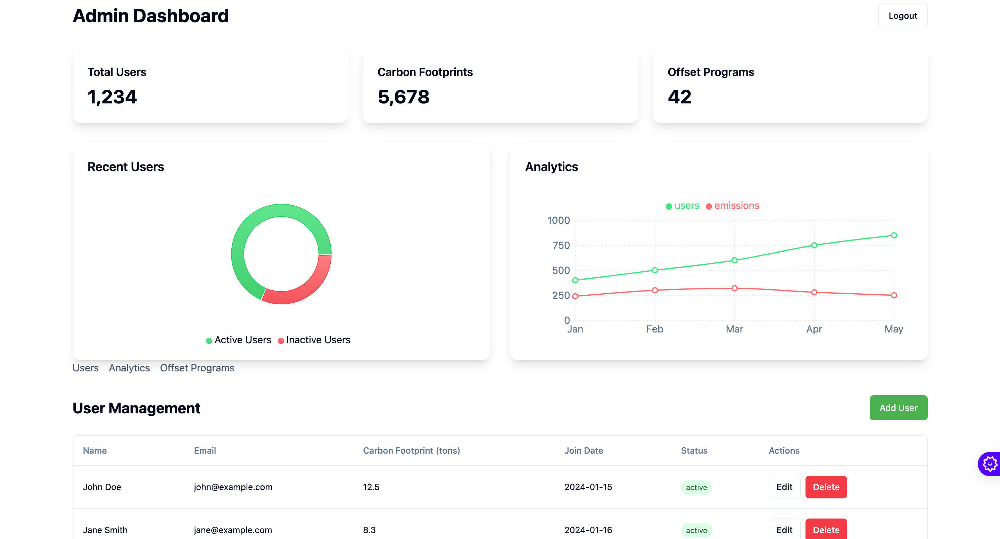

# 🌿 EcoTrack - Green Footprint Guide

EcoTrack is a comprehensive web application designed to help individuals and organizations track, understand, and reduce their carbon footprint while promoting sustainable living practices.



## ✨ Features

### 🧮 Carbon Calculator
Accurately measure your carbon footprint with our detailed calculator that considers:
- Transportation emissions
- Home energy usage
- Waste management



### 🌱 Offset Programs
Connect with verified carbon offset programs to neutralize your environmental impact:
- Tree planting initiatives
- Solar panel projects
- Wind energy support



### 📊 Analytics Dashboard
Track your progress and impact with detailed analytics:
- Personal carbon footprint trends
- Comparison with community averages
- Impact visualization

### 📝 Sustainability Blog
Stay informed with our regularly updated blog featuring:
- Eco-friendly living tips
- Climate action news
- Success stories

## 🚀 Getting Started

### Prerequisites
- Node.js (v18 or higher)
- npm or bun package manager

### Installation

1. Clone the repository
```bash
git clone https://github.com/yourusername/green-footprint-guide.git
cd green-footprint-guide
```

2. Install dependencies
```bash
bun install
# or
npm install
```

3. Start the development server
```bash
bun dev
# or
npm run dev
```

4. Open http://localhost:5173 in your browser

## 🛠️ Built With

- [React](https://reactjs.org/) - Frontend framework
- [Vite](https://vitejs.dev/) - Build tool
- [TailwindCSS](https://tailwindcss.com/) - Styling
- [React Router](https://reactrouter.com/) - Navigation
- [Framer Motion](https://www.framer.com/motion/) - Animations
- [Recharts](https://recharts.org/) - Data visualization

## 📱 Screenshots

### Home Page


### Admin Dashboard


### Blog Section


## 🤝 Contributing

We welcome contributions! Here's how you can help:

1. Fork the repository
2. Create your feature branch (`git checkout -b feature/AmazingFeature`)
3. Commit your changes (`git commit -m 'Add some AmazingFeature'`)
4. Push to the branch (`git push origin feature/AmazingFeature`)
5. Open a Pull Request

## 📄 License

This project is licensed under the MIT License - see the [LICENSE](LICENSE) file for details.

## 🙏 Acknowledgments

- Thanks to all contributors who have helped shape EcoTrack
- Special thanks to the open-source community
- Inspired by global climate action initiatives

## 📬 Contact

Have questions? Reach out to us:
- Email: contact@ecotrack.com
- Twitter: [@EcoTrack](https://twitter.com/ecotrack)
- Website: [www.ecotrack.com](https://www.ecotrack.com)

---

<p align="center">Made with 💚 for a sustainable future</p>
